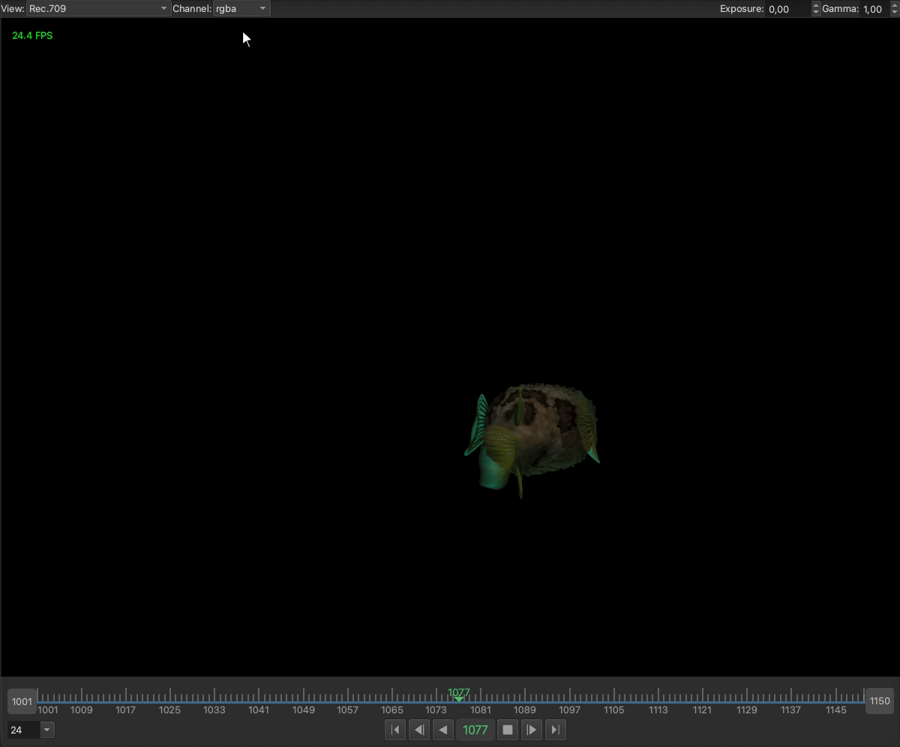

# image_sequence_view

Image Sequence Viewer in python (Qt)

### License

image_sequence_view is released under the [Apache License, Version 2.0](https://www.apache.org/licenses/LICENSE-2.0), which is
a free, open-source, and detailed software license developed and maintained by the Apache Software Foundation.

## Demo

